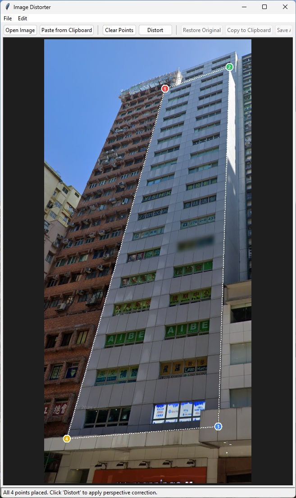
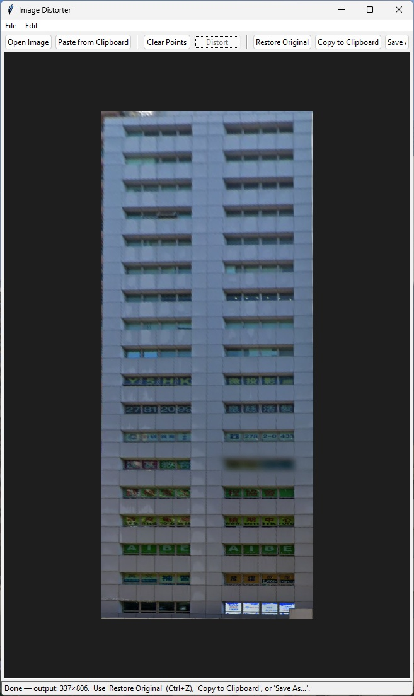

# ImageDistorter

A desktop application for correcting perspective distortion in images. Straighten angled or tilted photos by placing control points and applying perspective transformation.

## Features

- **Perspective Correction**: Adjust images with tilted or angled perspective
- **Interactive Interface**: Place control points directly on the image
- **Clipboard Support**: Paste images directly from clipboard
- **Multiple Export Options**: Save corrected images, copy to clipboard
- **Undo Support**: Easily revert changes
- **Built-in Preview**: See transformations in real-time

## Example

| Before | After |
|--------|-------|
|  |  |

## Requirements

- Python 3.8 or higher
- Windows (or any OS with Python support for the GUI components)

## Installation & Building

### Quick Build (Windows)

Run the build script to create a standalone executable:

```batch
build.bat
```

This will:
1. Create a Python virtual environment if needed
2. Install dependencies
3. Generate an application icon
4. Build `ImageDistorter.exe` in the `dist/` folder

### Manual Setup (Development)

1. **Install Python 3.8+** from [python.org](https://www.python.org)

2. **Create a virtual environment**:
   ```bash
   python -m venv .venv
   ```

3. **Activate the virtual environment**:
   - Windows (cmd): `.venv\Scripts\activate.bat`
   - Windows (PowerShell): `.venv\Scripts\Activate.ps1`
   - Linux/macOS: `source .venv/bin/activate`

4. **Install dependencies**:
   ```bash
   pip install -r requirements.txt
   ```

5. **Run the application**:
   ```bash
   python main.py
   ```

## Usage

1. **Open an Image**
   - Use `File → Open Image` or click "Open Image" button
   - Or paste from clipboard with `Ctrl+V`

2. **Place Control Points**
   - Click on the image to place up to 4 corner points
   - Colored markers appear at each point
   - You need exactly 4 points for perspective correction

3. **Apply Distortion**
   - Click "Distort" button to apply the perspective transformation
   - The corrected image will be displayed

4. **Save or Export**
   - Click "Save As…" to save the corrected image as a file
   - Click "Copy to Clipboard" to copy the image to clipboard
   - Use "Restore Original" to revert to the original image

5. **Undo Changes**
   - Use `Ctrl+Z` or `Edit → Undo` to undo the last action

## Dependencies

- **opencv-python**: Image processing and perspective transformation
- **Pillow**: Image manipulation and clipboard handling
- **numpy**: Numerical computations
- **pywin32**: Windows-specific functionality

## License

This project is provided as-is for personal and educational use.
